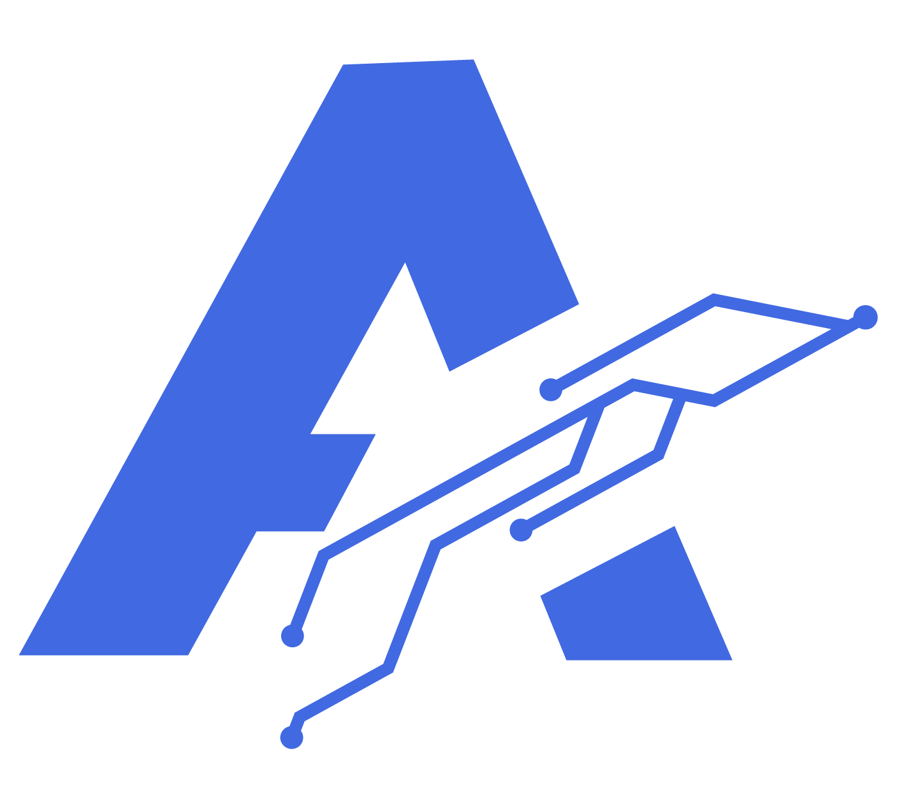

&nbsp;&nbsp;

&nbsp;&nbsp;

&nbsp;&nbsp;

&nbsp;&nbsp;

 
## About me
 
- 🎓 &nbsp;BSc. (Hons) in Computer Engineering (Undergraduate)
- 🏢 &nbsp;CEO & Founder at **Axsynthe Group**
- 🚀 &nbsp;Running a multi-domain business across IT, design, education & media
- 🛠️ &nbsp;3+ years coding · 5+ projects completed
- 📍 &nbsp;Based in Warawewa, Sri Lanka

Code is how I think. Business is how I execute. Professionally, simultaneously, relentlessly.

## Tech stack
 
**Frontend**

 

 
**Backend**
 

**Databases**
 

 

**Design & Media**
 

 

**Tools & DevOps**
 

## Current venture

**[Axsynthe Group](https://axsynthegroup.me)** is a multi domain innovation company founded during university building real solutions for real clients across five verticals.

💻 &nbsp;IT & Software &nbsp;·&nbsp; 🎨 &nbsp;Graphic Design &nbsp;·&nbsp; 🎓 &nbsp;Education &nbsp;·&nbsp; 📸 &nbsp;Photo & Video &nbsp;·&nbsp; 🌐 &nbsp;Web Development

 

## Featured projects

### 🛫 **ARS - Airline Reservation System**

This platform is a web based application developed as an initial software project to manage flight bookings and reservations. It allows users to search flights, create accounts, select seats, and confirm bookings through an intuitive interface, while also providing administrative features, secure session handling, and a responsive user experience.

📂 [**View Project Repository →**](https://github.com/Wanni46/ARS.git)

### 🎓 **VSGSLP - Virtual Study Groups & Social Learning Platform**

This platform is a web-based application developed as an initial software project for collaborative learning. It allows students to join study groups, access workshops, and follow announcements, while instructors support learning activities and admins manage users and platform operations, providing a simple, role-based, and user-friendly learning experience.

📂 [**View Project Repository →**](https://github.com/Wanni46/VIRTUAL-SOCIAL-LEARNING-PLATFORM.git)

### 🌐 **AxSynthe Group – Corporate Website**

This platform is a web-based corporate website designed to showcase the company's portfolio, services, and projects effectively. It provides an interactive and visually engaging interface, organized sections for service offerings, project highlights, and team information, along with smooth navigation and responsive design for seamless access across devices.

🌍 [**Visit Live Website →**](https://www.axsynthegroup.me)

### 🎓 **DCP – Digital Catalog Platform**

This platform is a web-based product catalog application developed using Next.js as an initial software project for sellers. It allows customers to browse products, search and filter items, view details, and place orders via WhatsApp, while admins can manage products, images, and popularity metrics through a dashboard, providing a simple, efficient, and user-friendly catalog experience.

📂 [**View Project Repository →**](https://github.com/Wanni46/NextJS-Catalog.git)

## GitHub stats

&nbsp;

  

---

## Currently learning

---

## Open to collaborate

I'm interested in connecting with people working on:

- 🌍 &nbsp;**Impactful web products** that solve real problems
- 🤝 &nbsp;**Open source projects** in the React / Node.js ecosystem
- 🎨 &nbsp;**Design + dev crossover** projects where UI quality matters
- 📚 &nbsp;**EdTech or creative tech** ventures

If you have something worth building — let's talk.

---

## Contribution graph

---

## Connect with me

 

