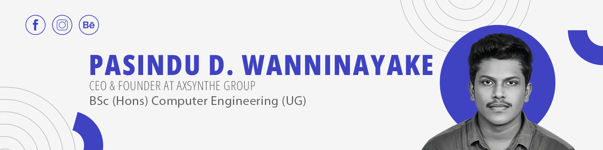

 

&nbsp;&nbsp;

&nbsp;&nbsp;

&nbsp;&nbsp;

&nbsp;&nbsp;

 
## About me
 
Code is how I think. Business is how I execute. Professionally, simultaneously, relentlessly.
 
- 🎓 &nbsp;BSc. Computer Science — studying the theory, building the practice
- ⚡ &nbsp;Fullstack with React + Node.js — end-to-end, no handoffs
- 🚀 &nbsp;Running a multi-domain business across IT, design, education & media
- 🏢 &nbsp;CEO & Founder at **Axsynthe Group**
- 🛠️ &nbsp;3+ years coding · 5+ projects shipped · 20+ clients served
- 📍 &nbsp;Based in Negombo, Sri Lanka
- 💡 &nbsp;I don't wait to graduate to start — I build, ship, and iterate now

---

## Tech stack

**Frontend**

**Backend**

**Databases**

**Design & Media**

**Tools & DevOps**

---

## Current venture

<table>
<tr>
<td width="60%">

**Multi-domain innovation business** operating across five verticals:

- 💻 &nbsp;**IT & Software** — custom solutions and web platforms
- 🎨 &nbsp;**Graphic Design** — branding, UI/UX, visual identity
- 🎓 &nbsp;**Education** — tutoring, digital learning resources
- 📸 &nbsp;**Photo & Videography** — professional media production
- 🌐 &nbsp;**Web Development** — end-to-end client projects

</td>
<td width="40%" align="center">

**Founded while in university.**
Building real products for real clients — not just coursework.

</td>
</tr>
</table>

---

## Featured projects

> 💡 Replace these cards with your actual repos and pin them on GitHub too.

<table>
<tr>
<td width="50%">

**🔗 Project One**
A brief one-liner about what it does and who it's for.

[View repo](https://github.com/wanni46) &nbsp;|&nbsp; [Live demo](#)

</td>
<td width="50%">

**🔗 Project Two**
A brief one-liner about what it does and who it's for.

[View repo](https://github.com/wanni46) &nbsp;|&nbsp; [Live demo](#)

</td>
</tr>
<tr>
<td width="50%">

**🔗 Project Three**
A brief one-liner about what it does and who it's for.

[View repo](https://github.com/wanni46) &nbsp;|&nbsp; [Live demo](#)

</td>
<td width="50%">

**🔗 Project Four**
A brief one-liner about what it does and who it's for.

[View repo](https://github.com/wanni46) &nbsp;|&nbsp; [Live demo](#)

</td>
</tr>
</table>

---

## GitHub stats

&nbsp;

  

---

## Currently learning

---

## Open to collaborate

I'm interested in connecting with people working on:

- 🌍 &nbsp;**Impactful web products** that solve real problems
- 🤝 &nbsp;**Open source projects** in the React / Node.js ecosystem
- 🎨 &nbsp;**Design + dev crossover** projects where UI quality matters
- 📚 &nbsp;**EdTech or creative tech** ventures

If you have something worth building — let's talk.

---

## Contribution graph

---

## Connect with me

 

